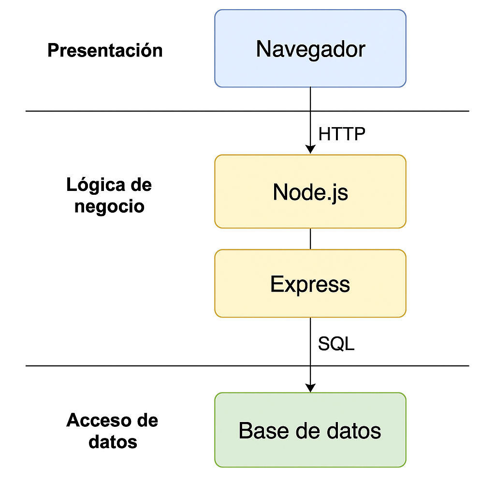

# 🚀 DevOps Hub

**DevOps Hub** es una plataforma web gratuita y ligera diseñada para pequeños equipos de desarrollo, estudiantes y desarrolladores freelance que necesitan gestionar el ciclo de vida de sus proyectos sin recurrir a herramientas pesadas como Jira o Azure DevOps.

---

## 💡 Motivación

En el contexto actual del desarrollo de software, muchas herramientas profesionales resultan excesivas o inaccesibles para proyectos individuales. **DevOps Hub** nace como una solución enfocada en la simplicidad, funcionalidad esencial y facilidad de uso.

---

## 🎯 Objetivos y funcionalidades previstas

Este proyecto se ha desarrollado siguiendo los objetivos definidos en el anteproyecto:

- [x] **HU1**: Registro e inicio de sesión de usuarios.
- [x] **HU2**: Creación de nuevos proyectos desde la plataforma.
- [x] **HU3**: Visualización de los proyectos personales en el dashboard.
- [x] **HU4**: Conexión con GitHub para mostrar repositorios públicos.
- [x] **HU5**: Validación de datos y protección contra accesos no autorizados.

---

## 🧠 Decisiones de diseño

- **Node.js + Express**: Ligero y eficiente para construir APIs REST.
- **SQLite**: Permite desarrollo local sin necesidad de configurar un servidor.
- **Bootstrap**: Acelera la maquetación con diseño responsive.
- **API GitHub**: Permite integración externa sin necesidad de OAuth.

---

## 🧩 Funcionalidades principales

- Registro e inicio de sesión de usuarios
- Creación y visualización de proyectos personales
- Conexión con GitHub para listar repositorios públicos
- Almacenamiento de datos en base de datos local (SQLite)
- Validación de formularios y consultas parametrizadas para seguridad

---

## 🛠 Tecnologías utilizadas

| Capa               | Tecnología           |
|--------------------|----------------------|
| Presentación       | HTML, CSS, JavaScript, Bootstrap |
| Lógica de negocio  | Node.js, Express.js  |
| Persistencia       | SQLite (en local) / PostgreSQL (producción recomendado) |
| Control de versiones | Git, GitHub |
| API externa        | GitHub REST API v3   |

---

## 🔌 API REST (ejemplo de endpoint)

### `POST /login`

Autenticar a un usuario con credenciales.

**Parámetros (body JSON):**

```json
{
  "username": "usuario",
  "password": "contraseña"
}
```

**Respuesta exitosa:**

```json
{
  "message": "Login successful",
  "userId": 1
}
```

**Errores comunes:**
- 400: Campos vacíos
- 401: Credenciales incorrectas

---

## 🧪 Instrucciones para levantar el proyecto en local

1. Clonar el repositorio:

```bash
git clone https://github.com/Amahoncortes/tfc_daw_dual_2025/
cd devops-hub
```

2. Instalar las dependencias:

```bash
npm install
```

3. Arrancar el servidor backend:

```bash
npm run dev
```

4. Abrir el archivo `public/index.html` en el navegador (utilicé Live Server para refresco de pantalla automático).

---

## ☁️ Despliegue en producción (Render)

1. Subir el proyecto a GitHub.
2. Crear cuenta en [Render](https://render.com/).
3. Crear un nuevo servicio de tipo Web Service con Node.js.
4. Configurar:
   - **Build Command**: `npm install`
   - **Start Command**: `npm run start`
   - Variables de entorno si fueran necesarias
5. Obtengo un dominio: https://devops-hub.onrender.com

---

## 🧭 Arquitectura del sistema

El sistema sigue una arquitectura en tres capas (presentación, lógica de negocio y acceso a datos).



---

## 🧱 Estructura del proyecto

```
├── app.js
├── package.json
├── package-lock.json
├── .env                # (no incluido en el repo)
├── README.md
├── public/
│   ├── index.html
│   ├── dashboard.html
│   ├── login.html
│   ├── register.html
│   ├── tasks.html
│   ├── handleUsers.html
│   ├── css/
│   │   └── style.css
│   └── js/
│       ├── auth.js
│       ├── checkSession.js
│       ├── dashboard.js
│       ├── handleUsers.js
│       ├── protectDashboard.js
│       ├── register.js
│       └── tasks.js
├── src/
│   ├── db/
│   │   ├── database.js
│   │   ├── database.sqlite
│   │   ├── sessions.sqlite
│   │   └── init.js
│   ├── middleware/
│   │   ├── auth.js
│   │   └── users.js
│   └── routes/
│       ├── auth/
│       │   └── login.js
│       ├── github/
│       │   └── repos.js
│       ├── project.js
│       ├── tasks.js
│       └── users.js
├── docs/
│   └── Anteproyecto/
│       ├── arquitectura.png
│       └── Versión_definitiva_anteproyecto.pdf
│
├── .env (no incluido en el repo)
└── README.md
```

---

## 🔐 Seguridad aplicada

- Validación de formularios en cliente y servidor
- Consultas SQL parametrizadas para evitar inyecciones
- Control de sesión básica con cookies

---
## 🔄 Mejoras respecto al anteproyecto

Aunque este proyecto se ha basado en una planificación previa recogida en el anteproyecto definitivo, durante el desarrollo real surgieron nuevas ideas y necesidades que me llevaron a implementar algunas funcionalidades extra no contempladas inicialmente. Estas mejoras reflejan un proceso iterativo auténtico, donde fui adaptando y ampliando el alcance según la evolución del trabajo.

### ✅ Funcionalidades añadidas durante el desarrollo:

- **Gestión de sesiones:** añadí un control de sesión para que los usuarios no tuvieran que iniciar sesión constantemente. También protegí el acceso al dashboard con scripts como `checkSession.js` y `protectDashboard.js`.

- **Página de gestión de usuarios:** implementé una vista específica (`handleUsers.html`) con su lógica para listar y gestionar usuarios. No estaba prevista en el anteproyecto pero resultó útil durante las pruebas.

- **CRUD de tareas:** desarrollé una funcionalidad completa para crear, listar y eliminar tareas. Incluye su propia ruta en el backend y página HTML dedicada. No estaba planteada originalmente pero fue una buena forma de ampliar el sistema y probar nuevas rutas.

- **Modularización del backend:** organicé mejor el backend separando rutas por módulos (`auth`, `github`, `users`, `tasks`) y utilizando middleware personalizado para validar accesos. Esto mejoró mucho la claridad del código.

- **Base de datos de sesiones independiente:** además de la base de datos principal, añadí un fichero `sessions.sqlite` para gestionar las sesiones de forma más limpia y separada.

- **Documentación de la API:** incluí un ejemplo de documentación de endpoints en el README y tengo la intención de extenderlo más adelante si amplío el sistema.

- **Imagen de arquitectura técnica:** elaboré un diagrama visual de las tres capas (frontend, lógica, datos) para acompañar la defensa y explicar mejor cómo está estructurado todo.
---


## 📎 Documentación adicional

- [Anteproyecto completo (PDF)](docs/Anteproyecto/Versión_definitiva_anteproyecto.pdf)

---

## 📚 Bibliografía / Recursos

- [MDN Web Docs](https://developer.mozilla.org/es/)
- [Node.js](https://nodejs.org/)
- [Express.js](https://expressjs.com/)
- [Bootstrap](https://getbootstrap.com/)
- [SQLite](https://www.sqlite.org/docs.html)
- [GitHub REST API](https://docs.github.com/es/rest)
