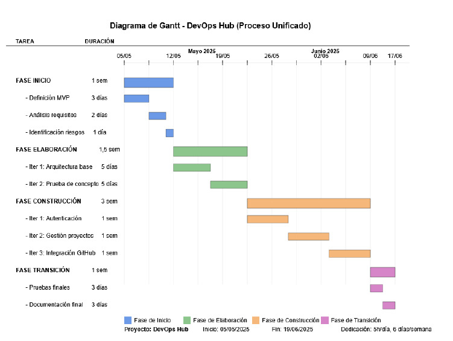

# 🚀 DevOps Hub

**DevOps Hub** es una plataforma web gratuita y ligera diseñada para pequeños equipos de desarrollo, estudiantes y desarrolladores freelance que necesitan gestionar el ciclo de vida de sus proyectos sin recurrir a herramientas pesadas como Jira o Azure DevOps.

---

## 💡 Motivación

En el contexto actual del desarrollo de software, muchas herramientas profesionales resultan excesivas o inaccesibles para proyectos individuales. **DevOps Hub** nace como una solución enfocada en la simplicidad, funcionalidad esencial y facilidad de uso.

---

## 🎯 Objetivos y funcionalidades previstas

Este proyecto se ha desarrollado siguiendo los objetivos definidos en el anteproyecto, organizados como historias de usuario (HU). Todas han sido implementadas y validadas mediante demostraciones funcionales en vídeo.

---

## 📺 Demostración en vídeo por historia de usuario

### ✅ **HU1: Registro e inicio de sesión de usuarios**

Se pretende demostrar que:

- Un usuario puede registrar su cuenta.
- Puede iniciar sesión con sus credenciales.
- El diseño del login es moderno y funcional, incluyendo validación visual, spinner de carga, gestión de errores, y un layout profesional.
- Se protege el acceso mediante control de sesión.
- [HU1 - Registro e inicio de sesión](https://github.com/Amahoncortes/tfc_daw_dual_2025/releases/tag/v1.0-hu1)

---

### ✅ **HU2: Creación de nuevos proyectos**

Se pretende demostrar que:

- Un usuario autenticado puede acceder al formulario de creación de proyecto.
- El formulario permite introducir nombre y descripción del proyecto.
- El proyecto se guarda correctamente en la base de datos.
- Se refleja automáticamente en el dashboard del usuario.
- [HU2 - Crear nuevos proyectos](https://github.com/Amahoncortes/tfc_daw_dual_2025/releases/tag/v1.1-hu2)

---

### ✅ **HU3: Visualización de proyectos en el dashboard**

Se pretende demostrar que:

- Tras iniciar sesión, el usuario accede a una vista principal (dashboard).
- Se muestra una lista de proyectos creados por ese usuario.
- La visualización es clara y muestra nombre, descripción y otros datos.
- [HU3 - Visualización de proyectos en el dashboard](https://github.com/Amahoncortes/tfc_daw_dual_2025/releases/tag/v1.2-hu3)

---

### ✅ **HU4: Conexión con GitHub para mostrar repos públicos**

Se pretende demostrar que:

- El usuario puede introducir su nombre de usuario de GitHub.
- La app consulta la API pública de GitHub.
- Se muestra una lista con los repositorios públicos asociados.
- [HU4 - Visualización de repositorios de GitHub](https://github.com/Amahoncortes/tfc_daw_dual_2025/releases/tag/v1.3-hu4)

---

### ✅ **HU5: Seguridad, validaciones y control de acceso**

Se pretende demostrar que:

- No se permite registro/login con campos vacíos o inválidos.
- Se muestra feedback visual claro ante errores de validación.
- Se usan consultas parametrizadas para evitar inyecciones SQL.
- Rutas sensibles están protegidas por control de sesión (`protectDashboard.js`).
- El backend bloquea accesos no autorizados.
- [HU5 - Seguridad y validaciones](https://github.com/Amahoncortes/tfc_daw_dual_2025/releases/tag/v1.4-hu5)

---

## 🧠 Decisiones de diseño

- **Node.js + Express**: Elegí esta combinación porque es ligera, fácil de entender y permite crear una API REST de forma muy rápida. Me resultó sencilla para estructurar el backend por módulos (rutas, middleware y base de datos).

- **SQLite**: Me pareció la opción más cómoda para trabajar en local sin tener que configurar nada. Es suficiente para este tipo de proyecto y me permitió guardar usuarios, proyectos y tareas de forma persistente.

- **express-session + connect-sqlite3**: Usé este sistema de sesiones para que se guardaran en disco en lugar de solo en memoria, así no se perdían al reiniciar el servidor. Esto fue clave para proteger bien el acceso al dashboard y mantener el login.

- **Bootstrap 5**: Lo utilicé para maquetar más rápido y asegurarme de que todo fuera responsive. Luego lo combiné con CSS personalizado para que el diseño se viera más profesional y no tan básico.

- **Diseño visual con curva y colores personalizados**: Cambié el diseño del login para hacerlo más moderno, usando una curva SVG y degradados azulados. Esto le da un aspecto más cuidado y profesional desde el primer momento.

- **GitHub API sin autenticación**: Decidí mostrar los repositorios públicos usando solo el nombre de usuario, sin complicaciones de OAuth. Para evitar errores de CORS, hice la petición desde el backend.

---

## 🧩 Funcionalidades principales

- Registro e inicio de sesión de usuarios con validaciones y feedback visual.
- Rediseño completo del login con layout moderno, curva SVG y spinner de carga.
- Creación, visualización y eliminación de proyectos personales.
- Gestión de tareas: crear, listar y eliminar tareas asociadas.
- Visualización de repositorios públicos de GitHub introduciendo el nombre de usuario.
- Página de administración de usuarios (accesible según el rol).
- Control de sesión persistente con protección de rutas mediante middleware.
- Almacenamiento de datos con SQLite (usuarios, proyectos, tareas y sesiones).
- Validación de formularios y uso de consultas SQL parametrizadas para mayor seguridad.

---

## 🛠 Tecnologías utilizadas

| Capa                 | Tecnología                                                               |
| -------------------- | ------------------------------------------------------------------------ |
| Presentación         | HTML, CSS personalizado, Bootstrap 5, JavaScript                         |
| Lógica de negocio    | Node.js, Express.js, express-session, connect-sqlite3                    |
| Persistencia         | SQLite (base de datos local para usuarios, proyectos, tareas y sesiones) |
| Control de versiones | Git, GitHub                                                              |
| API externa          | GitHub REST API v3 (repos públicos sin autenticación)                    |

---

## 🔌 API REST (ejemplo de endpoint)

A continuación, se muestra un ejemplo representativo del funcionamiento de la API backend. El resto de endpoints están organizados por rutas en `src/routes/`.

---

### `POST /auth/login`

Autenticar a un usuario con sus credenciales. Este endpoint también inicia una sesión persistente mediante cookies.

**Parámetros (body JSON):**

```json
{
  "username": "usuario",
  "password": "contraseña"
}
```

**Respuesta exitosa:**
{
"message": "Login successful",
"userId": 1,
"role": "user"
}

**Errores comunes**
400 Bad Request: Campos vacíos o mal formateados.
401 Unauthorized: Credenciales incorrectas.
500 Internal Server Error: Fallo en la base de datos o estructura del backend.

## 🧪 Instrucciones para levantar el proyecto en local

1. Clonar el repositorio:

```bash
git clone https://github.com/Amahoncortes/tfc_daw_dual_2025/
cd devops-hub
```

2. Instalar las dependencias:

```bash
npm install
```

3. Arrancar el servidor backend:

```bash
npm run dev
```

4. Abrir el archivo `public/index.html` en el navegador (utilicé Live Server para refresco de pantalla automático).

---

## ☁️ Despliegue en producción (Render)

1. Subir el proyecto a GitHub.
2. Crear cuenta en [Render](https://render.com/).
3. Crear un nuevo servicio de tipo Web Service con Node.js.
4. Configurar:
   - **Build Command**: `npm install`
   - **Start Command**: `npm run start`
   - Variables de entorno si fueran necesarias
5. Obtengo un dominio: https://devops-hub.onrender.com

---

## 🧭 Arquitectura del sistema

El sistema sigue una arquitectura en tres capas (presentación, lógica de negocio y acceso a datos).


---

## 🧱 Estructura del proyecto

```
├── app.js
├── package.json
├── package-lock.json
├── README.md
├── .env # (no incluido en el repo)

├── public/
│ ├── index.html # Página de bienvenida
│ ├── login.html # Pantalla de login (diseño moderno con curva SVG)
│ ├── register.html # Formulario de registro
│ ├── dashboard.html # Vista principal con proyectos y GitHub
│ ├── tasks.html # Gestión de tareas
│ ├── handleUsers.html # Gestión de usuarios (solo admins)
│ ├── css/
│ │ └── style.css # Estilos personalizados (combinado con Bootstrap 5)
│ └── js/
│ ├── auth.js
│ ├── checkSession.js
│ ├── dashboard.js
│ ├── handleUsers.js
│ ├── protectDashboard.js
│ ├── register.js
│ └── tasks.js

├── src/
│ ├── db/
│ │ ├── database.js # Conexión y queries a la BBDD
│ │ ├── database.sqlite # Base de datos de usuarios, proyectos y tareas
│ │ ├── sessions.sqlite # Base de datos separada para sesiones
│ │ └── init.js # Script de inicialización de tablas
│ ├── middleware/
│ │ ├── auth.js # Middlewares de sesión, roles y acceso
│ │ └── users.js # Middleware para validar usuarios
│ └── routes/
│ ├── auth/
│ │ ├── login.js # Endpoint de login (POST)
│ │ └── register.js # Endpoint de registro (POST)
│ ├── github/
│ │ └── repos.js # Consulta de repos públicos desde GitHub
│ ├── project.js # CRUD de proyectos
│ ├── tasks.js # CRUD de tareas
│ └── users.js # Consultas de usuarios y GitHub username

├── docs/
│ └── Anteproyecto/
│ ├── arquitectura.png
│ └── Versión_definitiva_anteproyecto.pdf
```

---

## 🔐 Seguridad aplicada

- **Validación de formularios** tanto en cliente como en servidor para prevenir envíos incompletos o maliciosos.
- **Consultas SQL parametrizadas** en todos los endpoints críticos para evitar inyecciones SQL.
- **Control de sesión persistente** usando `express-session` y `connect-sqlite3`, lo que garantiza que el usuario permanece autenticado tras el login incluso al recargar o cambiar de ruta.
- **Protección de rutas sensibles** mediante middlewares (`isAuthenticated`, `preventLoginIfAuthenticated`, `isAdmin`) que impiden el acceso a vistas como el dashboard, gestión de usuarios o tareas si no hay sesión activa.
- **Redirección automática**: Si un usuario intenta acceder al login estando ya logueado, se le redirige al dashboard automáticamente, y viceversa.
- **Mensajes de error controlados**: Se devuelve feedback claro al usuario en caso de errores de autenticación o acceso denegado.
- **Roles de usuario (user/admin)** para limitar la gestión de usuarios a administradores únicamente.

---

## 🔄 Mejoras respecto al anteproyecto

Aunque este proyecto se ha basado en una planificación previa recogida en el anteproyecto definitivo, durante el desarrollo real surgieron nuevas ideas y necesidades que me llevaron a implementar algunas funcionalidades extra no contempladas inicialmente. Estas mejoras reflejan un proceso iterativo auténtico, donde fui adaptando y ampliando el alcance según la evolución del trabajo.

### ✅ Funcionalidades añadidas durante el desarrollo:

- **Gestión de sesiones:** añadí un control de sesión para que los usuarios no tuvieran que iniciar sesión constantemente. También protegí el acceso al dashboard con scripts como `checkSession.js` y `protectDashboard.js`.

- **Página de gestión de usuarios:** implementé una vista específica (`handleUsers.html`) con su lógica para listar y gestionar usuarios. No estaba prevista en el anteproyecto pero resultó útil durante las pruebas.

- **CRUD de tareas:** desarrollé una funcionalidad completa para crear, listar y eliminar tareas. Incluye su propia ruta en el backend y página HTML dedicada. No estaba planteada originalmente pero fue una buena forma de ampliar el sistema y probar nuevas rutas.

- **Modularización del backend:** organicé mejor el backend separando rutas por módulos (`auth`, `github`, `users`, `tasks`) y utilizando middleware personalizado para validar accesos. Esto mejoró mucho la claridad del código.

- **Base de datos de sesiones independiente:** además de la base de datos principal, añadí un fichero `sessions.sqlite` para gestionar las sesiones de forma más limpia y separada.

- **Documentación de la API:** incluí un ejemplo de documentación de endpoints en el README y tengo la intención de extenderlo más adelante si amplío el sistema.

- **Imagen de arquitectura técnica:** elaboré un diagrama visual de las tres capas (frontend, lógica, datos) para acompañar la defensa y explicar mejor cómo está estructurado todo.

---

# ✅ Justificación de objetivos alcanzados

Las cinco historias de usuario comprometidas en el anteproyecto han sido desarrolladas e implementadas correctamente. Todas ellas están documentadas y demostradas en los vídeos enlazados a lo largo de este README.

Además, el proyecto ha evolucionado con numerosas mejoras adicionales que no estaban contempladas inicialmente, como el rediseño moderno del login, la gestión visual de usuarios, el CRUD completo de tareas o la modularización del backend. Estas ampliaciones han enriquecido significativamente la funcionalidad y la experiencia de usuario de la aplicación, respetando al mismo tiempo los principios de simplicidad y ligereza planteados desde el inicio.

> No queda ningún objetivo pendiente de cumplir, y se ha superado el alcance inicial en varios aspectos.

---

## 📎 Documentación adicional

- 📄 [Anteproyecto completo (PDF)](docs/Anteproyecto/Versión_definitiva_anteproyecto.pdf)

- 📦 [Diagrama de componentes](docs/Anteproyecto/Diagramas/diagrama_componentes.png)

---

## 🔄 Metodología de desarrollo y flujo de trabajo en GitHub (sin invents)

Durante el desarrollo de este proyecto no seguí ninguna metodología formal como Scrum o Kanban, ya que no las domino aún lo suficiente. Además, trabajé de forma completamente individual. Sin embargo, intenté organizarme siguiendo un enfoque **iterativo e incremental**, tal como recomendaba el ejemplo de anteproyecto proporcionado por el tutor, que me sirvió como principal guía.

Mi flujo de trabajo en GitHub fue el siguiente:

- Creé una rama `main` como rama estable principal donde solo subía código funcional.
- Para cada funcionalidad nueva, creaba una rama `feature/` específica. También utilicé ramas `bugfix/` para corregir errores surgidos durante el desarrollo. Por ejemplo, una de ellas arreglaba un fallo que provocaba que no se pudiera acceder al login si no tenías sesión.
- Cada rama contiene commits con mensajes descriptivos (por ejemplo: `feat: integración con GitHub`, `fix: validación de login`, `docs: actualizar README`). Aunque a veces, por error, agrupé demasiados cambios en un único commit, intenté mantener una trazabilidad razonable.
- Subía los cambios al finalizar cada historia de usuario para mantener el progreso ordenado.
- Utilicé **GitHub Releases** para empaquetar y documentar cada entrega, incluyendo un vídeo demostrativo por cada historia completada.

> En resumen: aunque fui autodidacta y el desarrollo fue completamente individual, mantuve un control de versiones ordenado, documentado y ligado directamente a los objetivos definidos.

## 🔄 Diagramas de Gantt: estimación vs. tiempo real

A continuación se muestran los dos diagramas de Gantt que resumen la planificación temporal del proyecto frente a su ejecución real:

- 📅 **Gantt inicial (estimación de tiempos del anteproyecto)**  
  Representa la planificación prevista al comienzo del proyecto.  
  

- ⏱️ **Gantt final (basado en commits y entregas reales)**  
  Muestra los tiempos reales invertidos durante el desarrollo, recopilados a partir del histórico de commits y tareas en Clockify.  
  

## 📊 Justificación de las diferencias en las estimaciones

Al comparar el cronograma planificado con los tiempos reales extraídos del historial de commits, hay diferencias bastante evidentes en algunas
fases del proyecto respecto a la previsión original.
A continuación, hago una explicación de las diferencias por fases y tareas:

### ✅ Coincidencias destacables

- La **fase de inicio** se desarrolló según lo planificado: entre el 18 y 19 de mayo definí el MVP, analicé los requisitos funcionales, diseñé la estructura inicial del proyecto y preparé la base técnica con Express y SQLite.

- La **fase de transición**, dedicada a pruebas finales, revisión de funcionalidades, grabación de vídeos y redacción del README, también se ejecutó conforme al cronograma previsto: del 15 al 18 de junio.

### ⚠️ Desviaciones y causas detalladas

#### 🟧 Iteración 2 – Gestión de proyectos (Planificada para 1 semana, llevó casi 3)

**Principales causas de desviación:**

- **Problemas con las sesiones**  
  Las rutas protegidas como el dashboard redirigían incluso a usuarios logueados, permitiendo dobles login. El problema residía en la mala persistencia de sesiones. Implementé `express-session` y `connect-sqlite3`, y rediseñé middlewares como `isAuthenticated`, `preventLoginIfAuthenticated` y `isAdmin`.

- **Estado inconsistente entre frontend y backend**  
  En algunos casos los datos se mostraban incorrectamente por problemas de sincronización entre `fetch()` y el DOM. Implementé `async/await` y reestructuré la renderización con `innerHTML`.

- **Rutas y controladores duplicados**  
  El CRUD de proyectos estaba mal distribuido entre varios archivos. Reorganicé las rutas en módulos (`routes/project.js`, `middleware/`, `db/`), clasificando cada parte según su responsabilidad funcional. Esto mejoró mucho la claridad y mantenimiento del backend.

- **Faltaban validaciones**  
  SQLite permitía insertar proyectos sin título o sin usuario asignado. Añadí `required` en el formulario y validaciones en el backend para asegurar la existencia de los campos necesarios.

- **Visualización inconsistente en el dashboard**  
  El dashboard no se actualizaba dinámicamente al crear un nuevo proyecto. Moví la lógica a una función reutilizable `loadProjects()`.

> **Resumen:** Esta fase se alargó debido a problemas derivados de mi inexperiencia. Cada error me obligó a repensar parte del sistema para mantenerlo estable.

---

#### 🟩 Iteración 2 – Prueba de concepto (control de sesiones)

- **Persistencia de sesión**  
  Las sesiones se perdían tras reiniciar el servidor. Añadí `connect-sqlite3` como almacenamiento persistente.

- **Redirección automática y bloqueo de rutas**  
  Unifiqué lógica backend/frontend para redirigir al dashboard tras login y bloquear acceso directo si no hay sesión activa.

- **Feedback visual tras login**  
  Añadí mensajes dinámicos de éxito/error en el login usando `Bootstrap alert`.

- **Visualización de usuario conectado**  
  Implementé un endpoint `/auth/status` para obtener `username`, `role` y `githubUsername`, y mostrar el nombre en pantalla tras login.

> **Resumen:** Tuve que rehacer el sistema de control de sesión desde cero, lo cual implicó más trabajo pero dio lugar a un sistema más robusto y seguro.

---

#### 🟦 Iteración 3 – Integración con GitHub

- **Problemas con CORS**  
  La API de GitHub no permitía llamadas directas desde frontend. Solucioné esto creando una ruta proxy en backend (`/github/repos`) que hace la petición desde Node.

- **Errores no tratados**  
  Si no había `githubUsername`, la app fallaba silenciosamente. Añadí validación en backend y mensajes de error específicos en frontend.

- **Precarga del GitHub username**  
  Modifiqué el endpoint `/auth/status` para incluir el `githubUsername` guardado y lo precargué en el formulario.

- **Endpoint para actualizar GitHub username**  
  Implementé `PUT /users/github`, validando que el campo no estuviese vacío ni fuese `null`.

- **Modificación de la base de datos**  
  Añadí la columna `github_username` con `ALTER TABLE`. Esto permitió guardar y mostrar correctamente el nombre de usuario en frontend.

- **Cambios en `dashboard.js`**  
  - Precarga del campo si ya existe en sesión.
  - Validación de campos vacíos.
  - Feedback visual con `alert-success` y `alert-danger`.

> **Resumen:** Aunque parecía una mejora menor, la integración con GitHub implicó cambios importantes en backend, base de datos y frontend, y me permitió afianzar el uso de APIs externas.


-**Clockify**

- [Clockify](docs/Anteproyecto/Diagramas/Clockify.png)

⏱️ **Análisis y justificación del tiempo invertido**
A lo largo del desarrollo del proyecto DevOps Hub, invertí aproximadamente 39 horas y 30 minutos, distribuidas en tareas registradas mediante Clockify. Aunque algunas fases se ajustaron bastante bien a lo estimado en el Gantt inicial, otras se extendieron más de lo previsto debido a la complejidad técnica o a mi proceso de aprendizaje. A continuación, detallo los principales bloques de trabajo:

🔹 MVP y definición (1h)
Esta fase fue breve porque ya tenía una idea clara desde el anteproyecto. Me centré en dejar clara la propuesta, definir las funcionalidades base y pensar en una arquitectura sencilla.

🔹 Requisitos y diseño técnico (1h 30m)
Analicé qué endpoints necesitaría, cómo dividir el backend, y qué partes del frontend harían falta. Esta tarea fue clave para organizarme aunque no dejara código escrito todavía.

🔹 Arquitectura base (3h)
Aquí dediqué tiempo a estructurar carpetas, configurar Express, SQLite y sessions. Lo que más me costó fue entender cómo persistir correctamente las sesiones en disco y proteger las rutas.

🔹 Autenticación (4h)
Aunque el login/logout básico fue rápido, se me complicó la gestión de sesiones y el control de acceso. Implementé varios middlewares para roles y protección de rutas, y eso me llevó más tiempo del esperado.

🔹 CRUD de proyectos (18h)
Este fue el bloque más largo. Al principio tenía el código duplicado o mal estructurado, lo que me obligó a reorganizar las rutas (project.js), modularizar el código y encapsular funciones como loadProjects() en el frontend. También invertí bastante tiempo en los botones de edición y borrado, en el formateo de fechas y en el diseño visual del dashboard.

🔹 Integración con GitHub (1h)
Parecía algo pequeño, pero tuve que añadir un endpoint intermediario en el backend por problemas de CORS, manejar errores como usuarios inexistentes, y añadir la precarga del GitHub username desde sesión. En total, fue más costoso de lo previsto.

🔹 Documentación y vídeos (2h)
Redactar el README y grabar los vídeos me llevó menos tiempo porque ya tenía el guión claro, y fui escribiendo documentación durante el desarrollo. Aun así, revisé todo varias veces para que el resultado final quedara claro, profesional y útil para la defensa.

🔹 Pruebas finales (2h)
Incluyen validaciones del flujo completo, repaso del login, redirecciones, errores de formulario y prueba de funcionalidades clave como roles o tareas. Aproveché para limpiar console.logs y mensajes irrelevantes.

## Presupuesto estimado para comprador

## 💰 Presupuesto estimado para comprador: Costes por fase del ciclo de vida

| Recurso / Fase                    | Inicio | Elaboración | Construcción | Transición | Total (€) | Detalles                                                                |
| --------------------------------- | ------ | ----------- | ------------ | ---------- | --------- | ----------------------------------------------------------------------- |
| 💻 Equipo informático             | 0 €    | 0 €         | 0 €          | 0 €        | 0 €       | Ordenador personal (amortizado previamente)                             |
| 🧠 Coste de trabajo (12 €/h)      | 36 €   | 96 €        | 240 €        | 36 €       | 408 €     | Basado en Clockify real: 3h/Inicio, 8h/Elaboración, 20h/Construcción... |
| ⚡ Electricidad (0,30 €/h aprox.) | 1 €    | 3 €         | 6 €          | 1 €        | 11 €      | Estimación por consumo medio del equipo                                 |
| 🌐 Internet                       | 2 €    | 2 €         | 3 €          | 1 €        | 8 €       | Parte proporcional del mes (tarifa mensual dividida entre fases)        |
| 🧰 Software libre                 | 0 €    | 0 €         | 0 €          | 0 €        | 0 €       | VS Code, Node.js, SQLite, DB Browser, GitHub... (todos gratuitos)       |
| 📚 Herramientas de documentación  | 0 €    | 0 €         | 0 €          | 0 €        | 0 €       | LibreOffice, draw.io (gratuitos)                                        |

---

### 📊 Total estimado: **427 €**

> **Amortización software**: No hay coste directo, ya que toda la pila de tecnologías empleada (Node.js, Express, SQLite, GitHub, Bootstrap, DB Browser, etc.) es de uso libre o gratuito, tanto en entorno de desarrollo como en despliegue (Render gratuito). Por tanto, su "amortización" se refleja en el valor del tiempo dedicado en cada fase.

## 🧠 Conclusiones

### a. Posibles mejoras

Aunque el proyecto cumple todos los objetivos definidos en el anteproyecto, hay margen para mejoras y nuevas funcionalidades. Algunas ideas que me planteo implementar en el futuro son:

- **Historial de cambios**: Añadir un log de actividad para cada proyecto, registrando acciones realizadas por los usuarios (ediciones, borrados, etc.).
- **Subida de archivos**: Permitir añadir documentos o imágenes a los proyectos, por ejemplo, documentación adicional o recursos del equipo.
- **Estadísticas**: Visualización de datos sobre proyectos creados, tareas completadas, tiempo invertido, etc.
- **Modo demo sin login**: Versión pública donde se pueda interactuar con la app sin necesidad de registrarse, útil para mostrar sin comprometer datos reales.
- **Tests automáticos**: Integrar pruebas unitarias y de integración para garantizar mayor estabilidad.
- **Mejoras visuales**: Uso de animaciones suaves, nuevos iconos y refuerzo de accesibilidad visual.
- **Roles avanzados**: Separación más granular de permisos (por ejemplo, editor, lector, administrador).

---

### b. Principales dificultades encontradas

Durante el desarrollo real del proyecto me enfrenté a varias dificultades técnicas y organizativas. Las más relevantes fueron:

- **Gestión de sesiones y autenticación**: Me costó entender bien cómo almacenar las sesiones de forma persistente con `express-session` y `connect-sqlite3`. Al principio permitía dobles login, redirecciones incorrectas y pérdidas de sesión al reiniciar el servidor.

- **Organización de rutas**: Al comienzo tenía código mezclado en `app.js` y otros módulos poco cohesionados. Reorganicé el backend en `routes/`, `middleware/` y `db/` para mantener una estructura limpia y modular, lo cual fue clave para no perderme a medida que crecía el código.

- **Validaciones de formularios**: SQLite permitía insertar registros vacíos. Tuve que añadir validaciones en frontend (`required`) y en backend (comprobación de que el `userId` proviene de una sesión activa y que el nombre no esté vacío).

- **Problemas visuales en el dashboard**: Al crear un proyecto, la lista no se actualizaba. Moví la lógica de carga a una función `loadProjects()` reutilizable, lo cual resolvió el problema.

- **Integración con GitHub**: El fetch desde frontend a la API de GitHub fallaba por CORS. Tuve que crear una ruta backend que actuara como proxy, y además gestionar errores como usuarios inexistentes o campos vacíos. También añadí precarga del username guardado desde backend al frontend.

- **Curva de aprendizaje**: Al desarrollar de forma completamente individual, hubo muchas veces en las que me encontraba bloqueado con errores pequeños que me costaban horas por falta de experiencia. Aun así, cada obstáculo fue una oportunidad de aprendizaje real.

---

En resumen, he ganado soltura en Node.js, comprensión del ciclo de vida de una aplicación y capacidad para organizar un desarrollo completo por fases, desde cero hasta el despliegue.

## 📚 Bibliografía / Recursos

- [MDN Web Docs](https://developer.mozilla.org/es/)
- [Node.js](https://nodejs.org/)
- [Express.js](https://expressjs.com/)
- [Bootstrap](https://getbootstrap.com/)
- [SQLite](https://www.sqlite.org/docs.html)
- [GitHub REST API](https://docs.github.com/es/rest)
